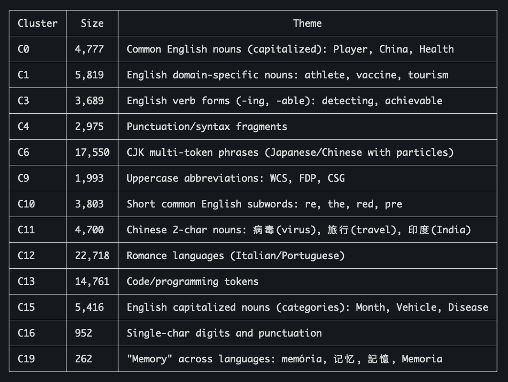

# Explore LLM Interpretability
LLM is very powerful. It can process lots of different problems in different fields. But we don't know how it process all the different informations inside the Transformer architecture. Can we find some relevance between the internal representations inside LLM and its text output? If so, we could do something like bypassing LLM's security mechanism, let it forget certain knowledge, or divise a compression algorithm that won't harm the performance very much. But how to do it?

## Word Embeddings
Let's dive into an open source LLM to start our exploration. Qwen3.5-4B is the one of newest models in the Qwen open source LLM family, featuring a mixed attention (1 softmax attention after 3 gated deltanet attention) and dense FFN layers, and can be deployed on most personal computers today. We start by looking at the word embeddings of this model. Word embeddings convert discrete tokens to vectors for later processing with Transformer. We use K-means to classify the normalized token vectors into 20 groups, and see whether each group has some special characteristics. The result is show below:

As we can see, tokens that have similar meanings do fall into the same category to some extent, with some common groups such as capitalized English words, two-character Chinese words, English subwords, programming subwords, etc. 

## Actication Distributions
Next let's move to the activation distributions of the model. I randomly sampled 256 token sequences from wikitext-2, a popular dataset for language modeling, each with a length of 2048 tokens. I want to know the variance of each activation channel and the variance for each token (position) in each Transformer block.

